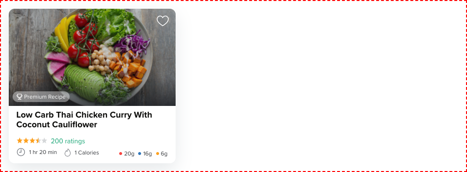

# Carb Manager Dev Assignment

## Solution

Here is the final result



## Few Caveat

- I have created an info component, where you have to pass icons as props which would be dynamic. So I had to place those icons in `/public/img` folder, because of this, storybook is unable to get the images.

- I have added few global styles in `PremiumRecipeCard` component just to make them load in storybook.

- I had a problem with the half-filled star, as its size was different after exporting from Figma. So I have created my own which seems to be a little buggy while changing the props in storybook

## How to create `compact` component from `PremiumRecipeCard` component

- `PremiumRecipeCard` component consists of a flex layout with header and footer, for a compact layout, I will just hide the footer and just show the header with the image

- This component also consists of various reuseable components like `ColorBadge`, `Rating`, `Info` and `Badge` which can be used to create a different layout for the compact component and can be used in the header of `PremiumRecipeCard`

## Unit Tests

- As this component was supposed to have few methods like `duration conversion` and `calorie conversion`, I decided to keep them in the same component instead of defining them in their respective component (which I have to create new), I defined the unit test for each method.

## Project setup

```
yarn install
```

### Compiles and hot-reloads for development

```
yarn serve
```

### Run Storybook

```
yarn storybook
```

### Run your unit tests

```
yarn test:unit
```
